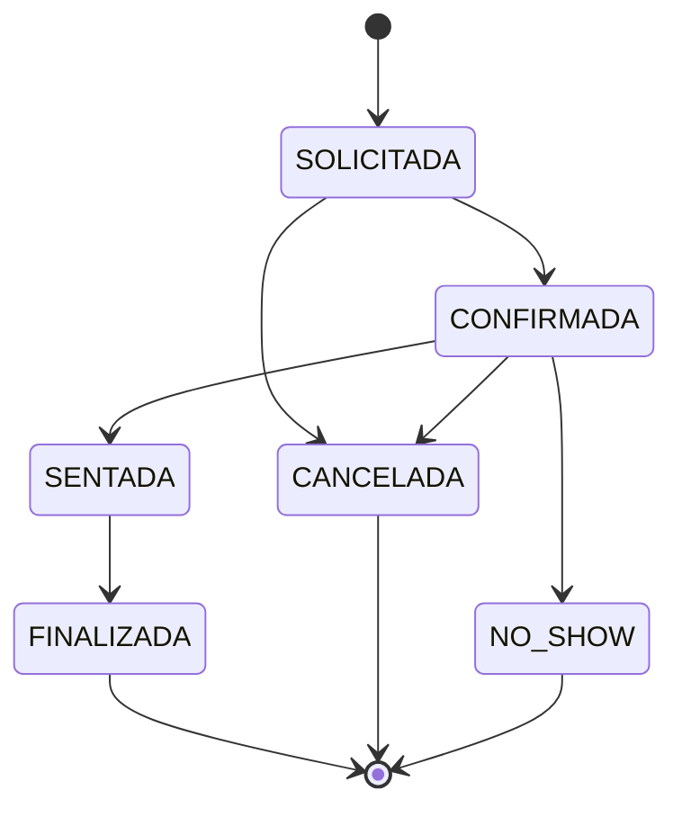

# GastroReserva — reglas de negocio

## RN-01 — Capacidad de mesa y turno

Una reserva debe respetar simultáneamente la capacidad individual de la mesa y la capacidad restante del turno para la fecha solicitada.

- Estados que consumen capacidad: `SOLICITADA`, `CONFIRMADA` y `SENTADA`.
- Estados que liberan capacidad: `FINALIZADA`, `CANCELADA` y `NO_SHOW`.
- No se permite reducir administrativamente la capacidad de una mesa o turno por debajo de reservas activas existentes.
- La creación bloquea primero el turno y luego la mesa para serializar validaciones concurrentes.

**Evidencia:** `DisponibilidadService`, `ReservaService`, `MesaService`, `TurnoService` y pruebas de reservas. Estado: **completo en backend**.

## RN-02 — Prevención de solapamientos

No se permiten reservas activas de una misma mesa cuyos intervalos se crucen. La condición de conflicto es:

```text
reservaExistente.inicio < nueva.fin AND reservaExistente.fin > nueva.inicio
```

Los turnos que terminan después de medianoche calculan el final en el día siguiente. La cancelación o finalización deja de bloquear el intervalo.

**Evidencia:** consulta de conflicto de `ReservaRepository`, bloqueo pesimista y pruebas positivas/negativas. Estado: **completo en backend**.

## RN-03 — Estados de reserva

Estados contractuales:

```text
SOLICITADA, CONFIRMADA, SENTADA, FINALIZADA, CANCELADA, NO_SHOW
```

Transiciones permitidas:



| Estado actual | Estados siguientes permitidos |
|---|---|
| SOLICITADA | CONFIRMADA, CANCELADA |
| CONFIRMADA | SENTADA, CANCELADA, NO_SHOW |
| SENTADA | FINALIZADA |
| FINALIZADA | Ninguno |
| CANCELADA | Ninguno |
| NO_SHOW | Ninguno |

Cada creación y transición registra estado anterior/nuevo, motivo, usuario y fecha.

El paso `CONFIRMADA → SENTADA` sólo puede ejecutarse mediante la operación de check-in para impedir que una transición genérica omita la validación y auditoría de mesa.

**Evidencia:** `EstadoReserva`, `ReservaPolicy`, `HistorialReserva`, `ReservaService` y pruebas de máquina de estados/check-in. Estado: **completo en backend**.

## RN-04 — Habilitación de pedido

Un pedido sólo puede crearse para una reserva en estado `SENTADA` o para una mesa abierta mediante el proceso operativo de apertura. No se permitirán pedidos huérfanos ni asociados a reservas solicitadas, confirmadas, finalizadas, canceladas o no-show.

**Evidencia:** `PedidoService`, `MesaAbiertaService`, V7 y pruebas de servicio/HTTP/concurrencia. Origen exclusivo, una orden por visita y rechazo de todos los estados no habilitados. Estado: **completo en backend**.

## RN-05 — Precio histórico

Al agregar un producto a un pedido, `ItemPedido` debe copiar el precio vigente del producto. Cambiar posteriormente el precio de `ProductoMenu` no debe alterar ítems ya registrados.

**Evidencia:** `ItemPedido` conserva nombre/precio, V7 y pruebas de modificación de catálogo, cantidades y agregados concurrentes. Estado: **completo en backend**.

## RN-06 — Total operativo, sin alcance fiscal

El sistema calculará únicamente:

```text
totalPedido = suma(item.cantidad × item.precioUnitarioHistorico)
```

No se incluirán contabilidad, facturación fiscal, métodos de pago ni documentos tributarios.

**Evidencia:** total derivado con BigDecimal de los ítems históricos, cantidades 1–999 y pruebas de sumas/edición. Estado: **completo en backend**.

## RN-07 — Feedback posterior a la visita

El cliente sólo puede registrar feedback cuando su reserva esté `FINALIZADA`. El backend debe comprobar la propiedad de la reserva y rechazar estados previos o finales diferentes.

**Evidencia:** `FeedbackService`, V8, DTO y permisos; sólo reserva propia FINALIZADA, una opinión por reserva, puntuación 1–5 y comentario obligatorio. Unicidad concurrente probada. Estado: **completo en backend**.

## RN-08 — Reasignación trazable

Toda reasignación debe registrar reserva, mesa anterior, mesa nueva, motivo, usuario y fecha. La mesa nueva debe estar activa, tener capacidad suficiente y no presentar solapamiento para el intervalo reservado.

El historial clasifica eventos de creación, cambio de estado, check-in y reasignación. Check-in y reasignación bloquean la reserva y las mesas en orden determinista antes de validar y escribir, y una visita sentada mueve el estado operativo `OCUPADA` a la mesa nueva y libera la anterior.

**Evidencia:** Flyway V5, `ReservaService`, endpoints `/check-in` y `/mesa`, y pruebas de reasignación válida, estado, permisos, capacidad, actividad, solapamiento y secuencia append-only. Estado: **completo en backend**.

## Matriz de cobertura

| Regla | Backend | Prueba automática | Evidencia manual | Web/móvil |
|---|:---:|:---:|:---:|:---:|
| RN-01 | Sí | Sí | Sí | Pendiente |
| RN-02 | Sí | Sí | Sí | Pendiente |
| RN-03 | Sí | Sí | Sí | Pendiente |
| RN-04 | Sí | Sí | Ejemplos preparados | Pendiente |
| RN-05 | Sí | Sí | Ejemplos preparados | Pendiente |
| RN-06 | Sí | Sí | Ejemplos preparados | Pendiente |
| RN-07 | Sí | Sí | Ejemplos preparados | Pendiente |
| RN-08 | Sí | Sí | Pendiente | Pendiente |
