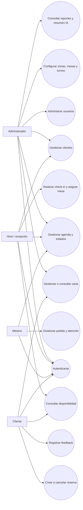
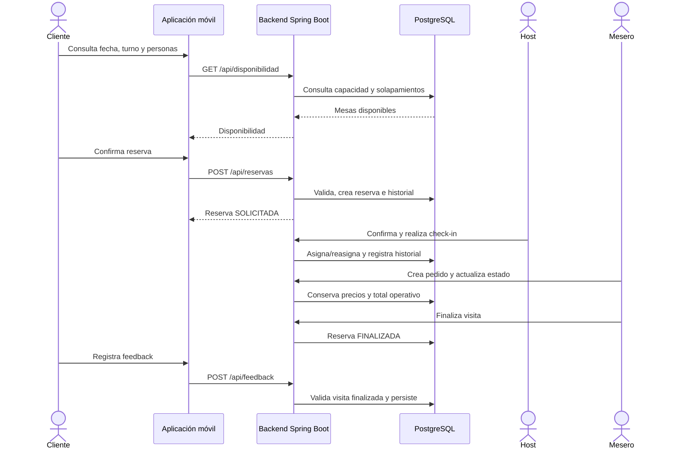

# GastroReserva — casos de uso y mapa de historias

## Diagrama general

## Catálogo de casos de uso

| ID | Caso de uso | Actor principal | Precondición | RF/RN | Estado |
|---|---|---|---|---|---|
| CU-01 | Registrarse e iniciar sesión | Todos | Cuenta activa o registro cliente válido | RF-01, RF-03 | Backend completo |
| CU-02 | Administrar usuarios y roles | Administrador | Sesión de administrador | RF-01 | Backend completo |
| CU-03 | Gestionar perfil/clientes | Host, cliente | Sesión autorizada | RF-02, RF-03, RF-05 | Backend completo |
| CU-04 | Configurar zonas y mesas | Administrador | Sesión de administrador | RF-03, RF-06, RN-01 | Backend completo |
| CU-05 | Configurar turnos y capacidad | Administrador | Sesión de administrador | RF-03, RF-07, RN-01 | Backend completo |
| CU-06 | Consultar disponibilidad | Cliente | Sesión activa; fecha, turno y personas | RF-02, RF-15, RF-16, RN-01, RN-02 | Backend completo |
| CU-07 | Crear reserva | Cliente, host | Cliente/turno/mesa activos y capacidad | RF-03, RF-08, RF-15, RF-16, RN-01 a RN-03 | Backend completo |
| CU-08 | Consultar o cancelar reserva propia | Cliente | Reserva propia | RF-02, RF-08, RN-03 | Backend completo |
| CU-09 | Gestionar agenda y estados | Administrador, host, mesero | Sesión operativa | RF-02, RF-04, RF-08, RN-03 | Backend completo |
| CU-10 | Realizar check-in y asignar/reasignar | Host | Reserva confirmada y mesa disponible | RF-09, RF-17, RN-01, RN-02, RN-03, RN-08 | Backend completo |
| CU-11 | Gestionar carta básica | Administrador | Sesión de administrador | RF-10 | Backend completo; UI pendiente |
| CU-12 | Consultar carta | Cliente, mesero | Sesión activa | RF-02, RF-10 | Backend completo; UI pendiente |
| CU-13 | Crear y modificar pedido | Mesero | Reserva sentada o mesa abierta | RF-11, RF-18, RN-04 a RN-06 | Backend completo; UI pendiente |
| CU-14 | Actualizar estado de atención | Mesero | Pedido/atención activa | RF-04, RF-12, RF-19 | Backend completo; UI pendiente |
| CU-15 | Finalizar visita | Mesero, host | Atención válida para finalizar | RF-04, RN-03, RN-07 | Backend completo; UI pendiente |
| CU-16 | Registrar feedback | Cliente | Reserva propia finalizada | RF-13, RN-07 | Backend completo; UI pendiente |
| CU-17 | Consultar ocupación y no-show | Administrador | Sesión de administrador | RF-14, RF-20 | Backend completo; UI pendiente |
| CU-18 | Consultar clasificación de comentarios | Administrador | Feedback existente; proveedor opcional | RNF-13 | Pendiente |

## CU-07 — Crear reserva

**Actor principal:** cliente.  
**Actor alternativo:** host, cuando registra una reserva telefónica/presencial.  
**Precondiciones:** usuario autenticado; cliente, mesa, zona y turno activos; datos válidos.

### Flujo principal

1. El actor selecciona fecha, turno, cantidad de personas y una mesa ofrecida por disponibilidad.
2. El backend bloquea el turno y la mesa durante la operación.
3. El backend calcula el intervalo, incluyendo el cambio de día para un turno nocturno.
4. El backend valida capacidad de mesa y capacidad restante del turno.
5. El backend comprueba que la mesa no tenga reservas activas solapadas.
6. El backend crea la reserva en `SOLICITADA`.
7. El backend registra el evento inicial en `historial_reservas` con usuario y fecha.
8. La API responde `201 Created` con un DTO de reserva.

### Flujos alternativos

- A1. Mesa o turno inexistente: `404 RESOURCE_NOT_FOUND`.
- A2. Datos obligatorios inválidos: `400 VALIDATION_ERROR`.
- A3. Capacidad insuficiente: `422 BUSINESS_RULE_VIOLATION`.
- A4. Solapamiento: `422 BUSINESS_RULE_VIOLATION`.
- A5. Actor sin permiso: `403 FORBIDDEN`.
- A6. Token ausente o inválido: `401 UNAUTHORIZED`.

### Postcondiciones

- La reserva y su historial quedan persistidos en una sola transacción.
- La capacidad y la mesa dejan de aparecer como disponibles para ese intervalo.

## CU-10 — Check-in, asignación y reasignación

**Actor principal:** host.  
**Estado:** backend implementado; experiencia web pendiente.

### Flujo esperado

1. El host localiza una reserva `CONFIRMADA`.
2. El sistema muestra mesas activas sin solapamiento y con capacidad suficiente.
3. El host confirma o cambia la mesa asignada.
4. El backend vuelve a validar capacidad y solapamiento dentro de una transacción.
5. Si cambia la mesa, registra mesa anterior, mesa nueva, motivo, usuario y fecha.
6. La reserva pasa a `SENTADA` y la mesa adquiere el estado operativo correspondiente.

### Alternativas

- Reserva en estado no permitido: rechazo `422`.
- Mesa insuficiente, inactiva u ocupada: rechazo `422`.
- Reserva o mesa inexistente: rechazo `404`.
- Actor sin permiso: rechazo `403`.

## Secuencia del flujo crítico

El flujo crítico completo está implementado y probado en backend, incluido pedido, cierre de atención y feedback. La secuencia de arriba describe las futuras pantallas: todavía no se ejecutó desde aplicaciones web/móvil conectadas. Ver [09-backend-handoff.md](09-backend-handoff.md).

## Mapa de historias por actividad

| Actividad | P0 — imprescindible | P1 — importante | P2 — complementario |
|---|---|---|---|
| Acceso | Autenticarse y aplicar rol | Mantener perfil propio | — |
| Planificar visita | Consultar disponibilidad; crear reserva; validar capacidad; evitar solapamiento | Cancelar; consultar mis reservas | Notificaciones |
| Preparar salón | Gestionar zonas/mesas; gestionar turnos | Consultar mapa y agenda | Preferencias operativas |
| Recibir cliente | Check-in; asignar mesa | Reasignar con historial | — |
| Atender visita | Crear pedido; cambiar estado; calcular total | Consultar carta disponible | — |
| Cerrar visita | Finalizar visita | Registrar feedback | Clasificación IA de comentarios |
| Supervisar | — | Ocupación; no-show; trazabilidad | Tendencias por tema/sentimiento |
