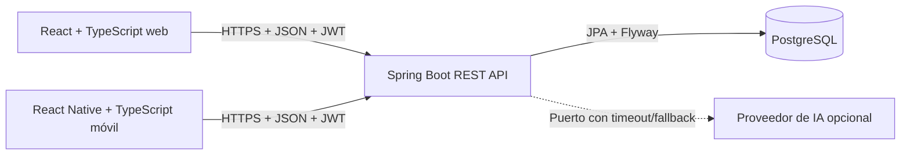

# GastroReserva — decisiones de arquitectura, modularidad y Git

## Vista general



El backend es un monolito modular desplegable como una sola aplicación. Web y móvil son clientes independientes que consumen el mismo contrato REST. PostgreSQL es la fuente de verdad. La IA es secundaria y nunca participa en reglas deterministas del flujo crítico.

## ADR-001 — Monolito modular incremental

**Estado:** aceptada.  
**Decisión:** mantener una aplicación Spring Boot y separar responsabilidades por módulos/casos de uso sin introducir microservicios.

**Razones:**

- El alcance y tamaño del equipo no justifican operación distribuida.
- Reservas, capacidad y pedidos necesitan transacciones consistentes.
- Permite evolucionar el código existente sin regenerar el proyecto.

**Consecuencia:** cada módulo mantiene controladores, DTO, servicios, entidades/repositorios y pruebas claramente identificables. La organización actual por capas técnicas es válida como punto de partida; podrá migrarse gradualmente a paquetes por funcionalidad cuando aumenten los módulos.

## ADR-002 — Hexagonal simplificada

**Estado:** aceptada como dirección arquitectónica.  
**Decisión:** aplicar separación de puertos y adaptadores donde aporte aislamiento real, sin exigir pureza académica que obligue a reescribir el backend.

| Elemento | Rol arquitectónico |
|---|---|
| Controladores REST y DTO | Adaptadores de entrada. |
| Servicios transaccionales | Casos de uso/aplicación y reglas coordinadas. |
| Entidades y políticas (`ReservaPolicy`) | Modelo y reglas deterministas. |
| Repositorios Spring Data | Adaptadores de persistencia. |
| PostgreSQL/Flyway | Infraestructura y esquema versionado. |
| Futura interfaz de clasificación de feedback | Puerto de salida para Spring AI. |

Las entidades actuales conservan anotaciones JPA. Esto es una simplificación consciente: el desacoplamiento contractual se obtiene mediante DTO y servicios, mientras los puertos explícitos se reservan para integraciones externas o reglas que necesiten sustitución.

## ADR-003 — API REST con DTO y errores uniformes

**Estado:** implementada.  
**Decisión:** no exponer entidades JPA. Cada entrada se valida mediante DTO y cada salida usa un contrato explícito. Los errores incluyen código, mensaje, ruta y errores de campo cuando corresponde.

Estados principales: `400`, `401`, `403`, `404`, `409` y `422`.

## ADR-004 — PostgreSQL y migraciones Flyway

**Estado:** implementada parcialmente.  
**Decisión:** PostgreSQL es la base obligatoria; Flyway es el único mecanismo de evolución y Hibernate valida con `ddl-auto=validate`.

H2 se usa exclusivamente en pruebas efímeras con compatibilidad PostgreSQL; no sustituye la base de producción. `scripts/verify-postgres.ps1` verifica V1–V8 y actualización V5→V8 en una instancia PostgreSQL temporal separada. No usa Docker ni modifica la base habitual.

## ADR-005 — Autenticación stateless y rol vigente

**Estado:** implementada.  
**Decisión:** usar contraseñas BCrypt y JWT HS256 de corta duración. En cada petición protegida se vuelve a consultar el usuario para aplicar rol y estado vigentes, evitando que un token conserve privilegios retirados.

Los secretos se proporcionan mediante variables de entorno y nunca se versionan.

## ADR-006 — Consistencia concurrente de reservas

**Estado:** implementada.  
**Decisión:** bloquear pesimistamente turno y mesa durante la creación, consultar conflictos por intervalo y usar versión optimista para cambios de la reserva.

Esto protege capacidad agregada y solapamientos incluso cuando dos solicitudes llegan casi simultáneamente. Pedido bloquea primero origen (reserva/apertura) y luego pedido, con el mismo origen bloqueado al finalizar visita. La unicidad también está restringida en V7/V8. Las pruebas de concurrencia usan dos hilos y transacciones confirmadas en H2 y PostgreSQL temporal.

## ADR-007 — Auditoría de procesos

**Estado:** implementada para reservas y pedidos.
**Decisión:** creación, cambios de estado, check-in y reasignación generan eventos persistidos con tipo, estado anterior/nuevo, motivo, usuario y fecha. Cuando corresponde también conservan mesa anterior y nueva. Pedidos registra además cambios de ítems y responsable, con actor y fecha.

## ADR-008 — Estrategia de Git y ramas

**Estado:** Git inicializado y con historial en `main`; el siguiente flujo de ramas sigue siendo la estrategia propuesta, no una afirmación de que todas esas ramas ya existan.

### Ramas

| Rama | Propósito |
|---|---|
| `main` | Versiones demostrables y estables. |
| `develop` | Integración del siguiente incremento. |
| `feature/<descripcion>` | Funcionalidad nueva y acotada. |
| `fix/<descripcion>` | Corrección de defecto. |
| `docs/<descripcion>` | Documentación sin cambio funcional. |

No se crearán ramas de larga duración adicionales sin necesidad. Cada rama parte de `develop`, se verifica y se integra mediante pull request; los lanzamientos pasan de `develop` a `main`.

### Convención de commits

Se usará Conventional Commits con mensajes breves en imperativo:

```text
feat(reservas): impedir solapamientos por intervalo
fix(auth): aplicar el rol vigente del usuario
test(turnos): cubrir capacidad activa
docs(modelo): agregar DER y diccionario de datos
chore(ci): ejecutar Maven verify en GitHub Actions
```

Tipos permitidos inicialmente: `feat`, `fix`, `test`, `docs`, `refactor`, `chore` y `ci`.

### Reglas de integración

1. No confirmar secretos, `target`, archivos de IDE ni credenciales HTTP.
2. Un commit debe representar un cambio coherente y verificable.
3. El pull request debe indicar RF/RN relacionados, pruebas ejecutadas y pendientes.
4. `main` sólo recibe cambios compilables con pruebas verdes.
5. Las migraciones aplicadas no se editan; cualquier cambio usa una nueva versión Flyway.

## ADR-009 — Pruebas y evidencia

**Estado:** implementada parcialmente.  
**Decisión:** priorizar pruebas de servicios/reglas, autorización HTTP, migraciones y controladores. Cada flujo crítico debe incluir éxito y al menos un error de negocio.

Comando base:

```powershell
.\mvnw.cmd verify
```

Web y móvil incorporarán comprobación de tipos, lint y pruebas de los flujos que consumen la API. GitHub Actions ejecutará estas verificaciones cuando existan los tres proyectos.

## ADR-010 — IA desacoplada y no bloqueante

**Estado:** pendiente.  
**Decisión:** la clasificación de feedback se ubicará detrás de una interfaz de aplicación. El adaptador Spring AI tendrá timeout, registro de errores y fallback determinista. Ninguna reserva, visita, pedido, finalización, feedback o reporte base dependerá de la disponibilidad del proveedor.
