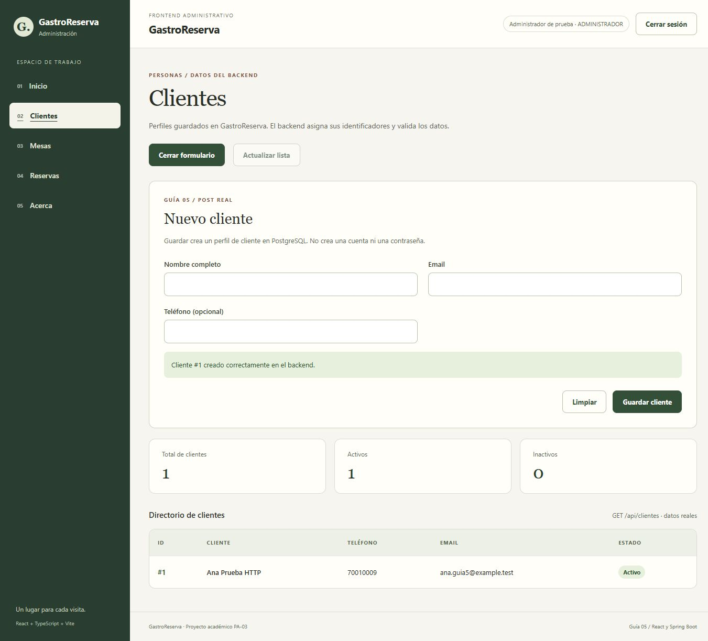

# Evidencias — guía 05

Fecha local: 2026-10-08 (America/La_Paz). Datos ficticios y servicios aislados, sin modificar la base habitual.

## Entorno

- Frontend de WebStorm, mismo código entregado, Vite temporal en 127.0.0.1:5174.
- API Spring Boot de prueba en 127.0.0.1:18080.
- PostgreSQL 17 aislado, puerto 51744, base gastro_guia5.
- Flyway V1–V8 y esquema real. Zona, mesa y turno sembrados sólo en esa base.
- Token/contraseñas de prueba no incluidos en estas evidencias.
- API, Vite de pruebas y PostgreSQL temporal apagados al finalizar. Vite normal 5173 se conserva para el usuario.
- Logs y base temporal conservados en C:/Users/antel/AppData/Local/Temp/gastro-guia05-f7f800155c3d498e846a88a8ff6e2615; no publicar esa carpeta.

## Recorrido verificado

| Acción | Resultado |
|---|---|
| Login administrativo | 200; token en memoria y entrada a Clientes |
| Listado inicialmente vacío | 200; mensaje de vacío |
| Enviar formulario vacío | Errores locales, sin alta |
| Crear Ana Prueba HTTP | POST /api/clientes 201; id=1; reset y fila real |
| Repetir correo | 409; datos escritos conservados; sigue una fila |
| Actualizar lista | GET 200; cliente persiste |
| Consultar catálogos | GET clientes/mesas/turnos 200; sólo opciones activas ofrecidas |
| Crear reserva | POST /api/reservas/operativas 201; clienteId=1, mesaId=1, turnoId=1, 4 personas, fecha 2030-01-15 |
| Respuesta y tabla | Reserva id=1, cliente Ana Prueba HTTP, mesa número 12, estado SOLICITADA |
| Repetir reserva solapada | 422; datos escritos conservados; sigue una reserva |
| Mesero autenticado | Agenda visible, botón de alta ausente; Clientes denegado |
| CORS no permitido | OPTIONS 403 para localhost:5174; error visible en login |
| Backend detenido | Error visible, Reintentar carga y sin datos inventados |
| API reiniciada con otra clave temporal | 401 invalida token previo; nuevo login recupera cliente/reserva existentes |
| Ruta inexistente autenticada | 404 ROUTE_NOT_FOUND después de corrección |
| Body cliente inválido enviado directamente por HTTP | 400 y fieldErrors |

La consulta SQL de comprobación unió reservas, clientes y mesas: reserva_id=1, cliente_id=1, nombre=Ana Prueba HTTP, mesa_id=1, numero=12, estado=SOLICITADA, cantidad_personas=4. Confirma persistencia y diferencia entre ID de mesa y número visible.

## Extracto del access log del servidor

Es un registro de método/ruta/status, **no una captura de DevTools Network**. No contiene headers ni cuerpos.

```text
POST_/api/auth/login_200
GET_/api/clientes_200
POST_/api/clientes_201
POST_/api/clientes_409
GET_/api/reservas_200
GET_/api/turnos_200
GET_/api/mesas_200
POST_/api/reservas/operativas_201
POST_/api/reservas/operativas_422
POST_/api/clientes_400
OPTIONS_/api/clientes_200
OPTIONS_/api/clientes_403
GET_/api/clientes-inexistentes_404
GET_/api/reservas_401
POST_/api/auth/login_200
GET_/api/clientes_200
GET_/api/reservas_200
```

La primera prueba de ruta equivocada había respondido 500; se corrigió el manejador y se volvió a comprobar 404 contra el JAR recompilado.

## Capturas reales de interfaz

- [Cliente creado y tabla actualizada](cliente-creado.png).
- [Reserva creada y confirmación](reserva-creada.png).
- [Agenda en pantalla angosta](agenda-movil.png).
- [Persistencia después de reiniciar API](agenda-persistida.png).
- [CORS rechazado](cors-rechazado.png).
- [API apagada y mensaje de error](backend-apagado.png).



## Verificaciones automáticas

Frontend: npm test, 32 pruebas aprobadas. npm run lint sin errores/advertencias; build TypeScript/Vite correcto con VITE_API_URL pública configurada.

Backend: Maven verify offline con JDK 21; 112 pruebas H2, cero fallos/errores/omitidas, BUILD SUCCESS. La suite completa sobre PostgreSQL no se repitió en este incremento; los escenarios HTTP anteriores sí usaron PostgreSQL real temporal.

Las capturas Network de GET/POST siguen pendientes de tomarse con el estudiante según [las instrucciones de la guía](../../guia-05.md). Swagger UI no estaba instalado; no se afirma haberlo usado.
