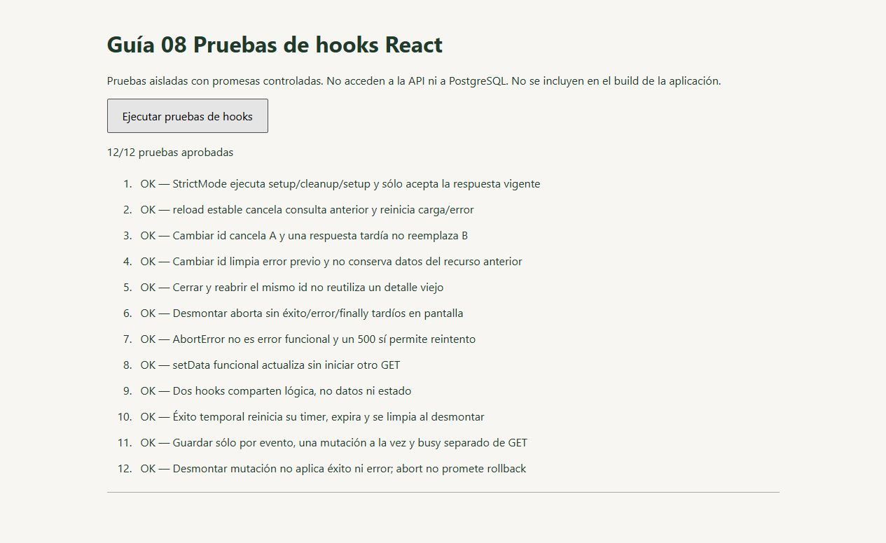
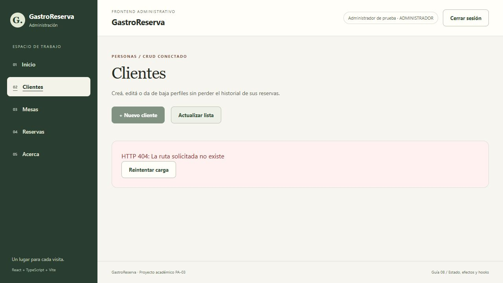
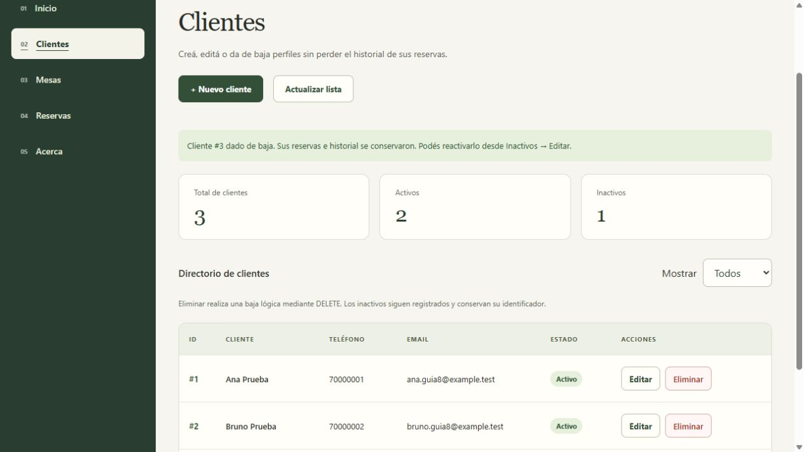
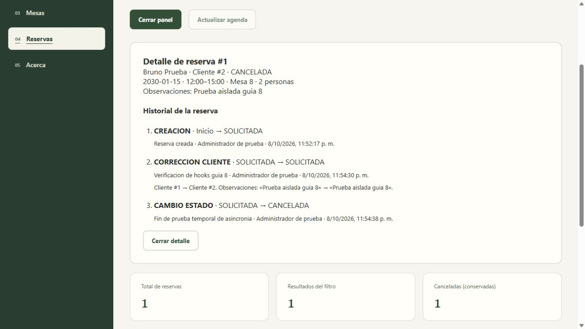

# Guía 08 — evidencia de estado y asincronía

Fecha de ejecución: 2026-10-08, America/La_Paz. Datos ficticios en PostgreSQL 17 temporal, separado del PostgreSQL habitual. API Spring Boot existente en 18082, Vite de verificación en 5174 y proxy local de prueba en 18084. No se usaron credenciales habituales ni se modificaron archivos .env, CORS del proyecto o migraciones.

## Pruebas automatizadas

- `npm.cmd test`: 67 pruebas Node aprobadas, incluidas 9 nuevas para cancelación, carrera, error, finally tardío e independencia de consultas.
- `/tests/hooks.html`: 12/12 con React real, createRoot, act y StrictMode. Promesas controladas, sin HTTP/DB: ids fuera de orden, limpieza, reload estable, cierre/reapertura, setData funcional, instancias independientes, timer y mutaciones desde eventos.
- Lint y build de producción correctos. Las pruebas del navegador no se incluyen en el build ni forman parte del comando npm test.

## Recorrido con HTTP y PostgreSQL reales

| Acción observada en la UI | Resultado |
|---|---|
| Login administrativo temporal | POST 200; listado real de clientes. |
| Editar cliente #2 y Cancelar consulta mientras carga | GET cancelado en el proxy; vuelve la tabla sin error ni formulario tardío. |
| Actualizar lista con fallo controlado | HTTP 404 de Spring, mensaje visible y botón Reintentar carga. |
| Reintentar carga | GET 200; vuelve el listado. |
| Crear Carla | POST /clientes 201; fila #3 y contador actualizados. |
| Editar Carla a Carla Actualizada | GET 200 + PUT 200; mismo id, fila reemplazada. |
| Confirmar baja y seleccionar Todos | DELETE 204; fila #3 conservada como Inactivo. |
| Editar reserva #1, cancelar consulta y reabrir | Primer GET cancelado; nueva consulta carga el detalle correcto. |
| Corregir reserva #1 de Ana a Bruno, con motivo | PUT /reservas/1/datos-cliente 200; mismo id, filtro/tabla sincronizados. |
| Cancelar reserva #1 con motivo | PATCH /reservas/1/estado 200; fila CANCELADA conservada y botones incompatibles deshabilitados. |
| Abrir Detalle | GET de reserva e historial; CREACION, CORRECCION_CLIENTE y CAMBIO_ESTADO visibles. |
| Crear reserva para Ana el 2030-01-18 | POST /reservas/operativas 201; fila #2 SOLICITADA, contadores/filtro sincronizados. |

El proxy de prueba retrasó GET por id 2 segundos para hacer observable la cancelación. Para un único GET de clientes, se lo redirigió a una ruta inexistente de la **API temporal**, obteniendo un 404 real de Spring. Fue una inyección de fallo explícita, no un error espontáneo del endpoint ni una respuesta inventada por React. El siguiente reintento llegó a la ruta correcta y recibió 200. No se añadió ese proxy a la configuración del proyecto.

El primer intento de cancelar un detalle terminó demasiado rápido; se repitió y el registro posterior confirmó `GET /api/clientes/2 CANCELED`. También se confirmó cancelación del GET de reserva. Las pruebas aisladas cubren resultados tardíos incluso cuando el loader ignora signal.

No se observaron advertencias/errores de React en los registros de consola consultados. Los códigos HTTP se contrastaron con los registros de acceso, no se deducen sólo del texto verde de la UI. Los registros no incluyen tokens, contraseñas, headers ni cuerpos.

## Límites de la evidencia

Estas capturas son de la aplicación y de la página de pruebas, **no** de DevTools Network. El estudiante aún debe capturar Network y explicar el flujo en su defensa. No se probó carga productiva ni todos los roles por navegador en esta guía; se conservaron los contratos y pruebas previas. No se volvió a ejecutar la suite Maven (sin cambios Java/SQL).

Servicios de prueba detenidos al finalizar; logs y cluster temporal conservados en `C:/Users/antel/AppData/Local/Temp/gastro-guia07-54f9e398222045dd81ea051097be557b` (el prefijo corresponde al helper reutilizado). Los registros ficticios permanecen en ese cluster aislado; no están en la base habitual. No se borraron datos del usuario ni se apagaron sus servicios.
